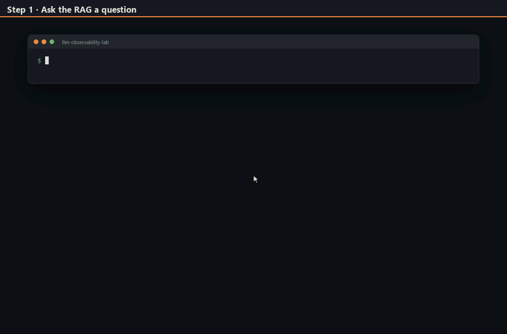
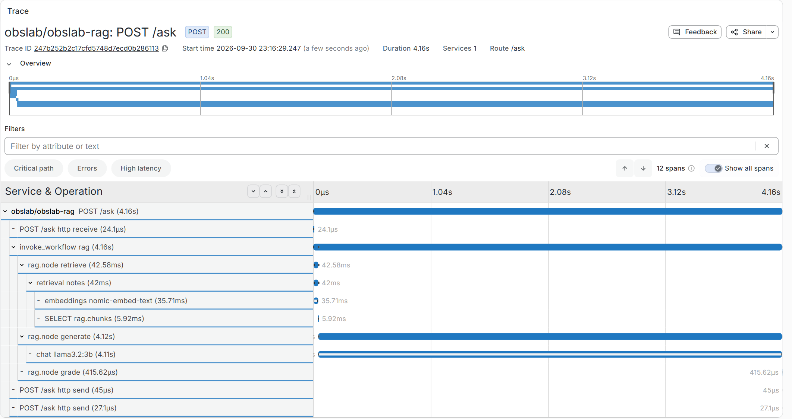
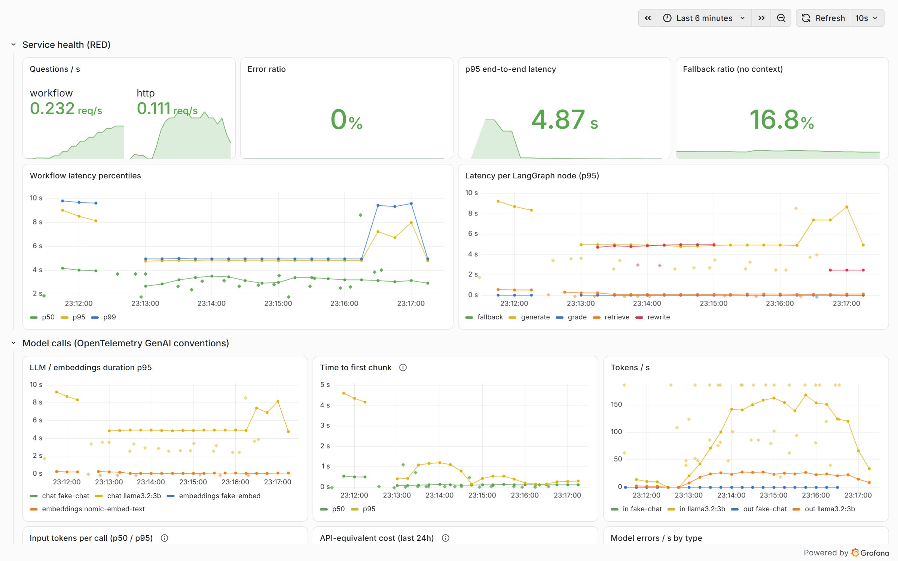

#  llm-observability-lab

[](https://github.com/jmiliamine/llm-observability-lab/actions/workflows/ci.yml)
[](LICENSE)
[](pyproject.toml)
[](https://opentelemetry.io/docs/specs/semconv/gen-ai/)
[](.github/SECURITY.md)
[](https://www.linkedin.com/in/jmiliamine/)

A RAG over your own notes, built with LangGraph, instrumented with the
[OpenTelemetry GenAI semantic conventions](https://opentelemetry.io/docs/specs/semconv/gen-ai/),
and observed with Prometheus, Tempo, Loki and Grafana. The notes are searched with pgvector.
Everything runs in a two-node k3d cluster set up like a small company platform: Gateway API,
pinned Helm charts, restricted pods, SLO alerts.

One question, followed from the terminal to its trace:

1. **Ask the RAG a question.** The answer comes back with its sources, a groundedness
   score and a `trace_id`.
2. **Monitor it in Grafana.** Latency per LangGraph node, tokens per second, time to first
   chunk, similarity score of the retrieved notes, groundedness of the answers.
3. **Follow its trace.** The cascade of spans for that same question: retrieval, embedding,
   SQL query, model call, with the token counts on the model span.



Most LLM demos stop at the answer. This lab is about what happens around it. For every
question you can see how long each step took, how many tokens it used, why it ended in
"I don't know", and which pod served it. The same trace ID links the metric, the trace and the log line.

## What is in the box

- **The app.** A LangGraph flow: `retrieve → generate → grade`, with one query rewrite
  before giving up. Served by FastAPI (two replicas), local models through Ollama.
- **The vector store.** PostgreSQL with pgvector. The API connects with a read-only role,
  and the ingest job rebuilds the index and swaps it in atomically. An index built with another
  embedding model is refused.
- **The telemetry.** One trace per question, from the HTTP request down to each model call,
  named after the GenAI conventions (`chat llama3.2:3b`, `gen_ai.client.operation.duration`...).
  Prompts stay off the traces unless you opt in.

  
- **The platform.** kube-prometheus-stack, Tempo, Loki and the OpenTelemetry Collector
  from pinned Helm charts, Traefik as the Gateway API implementation, a local image registry.
- **The operations side.** SLO recording rules and alerts,
  a dashboard generated from code, liveness and readiness probes that answer different
  questions.

## Architecture


More detail, including what each namespace owns and how a request is traced, in
[docs/architecture.md](docs/architecture.md).

## Quick start

Tested on Windows 10 with Docker Desktop. Linux and macOS should work (every command
goes through [Task](https://taskfile.dev)), but have not been tested yet.

You need Docker Desktop with about **10 GB of memory** for its VM, and these tools:

```bash
winget install Docker.DockerDesktop Task.Task k3d.k3d Kubernetes.kubectl Helm.Helm astral-sh.uv
```

Ollama is optional. Without it, the lab runs with built-in fake models (see below).

```bash
winget install Ollama.Ollama
```

```bash
ollama pull llama3.2:3b
```

```bash
ollama pull nomic-embed-text
```

Then, from the repository:

```bash
task doctor
```

```bash
task setup
```

```bash
task up
```

`task up` takes about 15 minutes the first time: it creates the cluster, installs the
platform, builds the image, starts PostgreSQL, indexes the notes of the data lake (`datalake/`)
into it and deploys the API.
No GPU or no Ollama? Use `task up OVERLAY=fake` instead. Everything is the same except the
answers, which become extracts of the notes instead of generated text.

Send some traffic and open Grafana:

```bash
task load
```

| What | Where |
|---|---|
| Ask a question | `task ask Q="How do taints and tolerations work?"` |
| Grafana | http://grafana.localhost:8080 (user `admin`, password from `task grafana:password`) |
| Prometheus | http://prometheus.localhost:8080 |

The dashboard is in the *LLM Observability* folder. Click a point on a latency panel to jump
to an example trace (exemplars), then from a span to its logs.



`task stop` pauses the cluster and gives the memory back; `task start` resumes it with all
its data. `task cluster:down` deletes it.

## Your own notes

The notes live in a data lake: a folder of `.md` or `.txt` files, `datalake/` by default, which
ships with the sample notes. The image holds code only. The ingest job mounts the folder
read-only and writes the index to PostgreSQL; the API reads the index and never sees the files.

Add, edit or remove notes in the folder, then re-index:

```bash
task app:ingest
```

No image is rebuilt and no pod restarts. The API keeps answering from the previous index until
the new one is complete.

To use another folder, give it when the cluster is created (the mount is set at creation):

```bash
task up DATALAKE=D:/path/to/notes
```

The notes are only read from that folder and indexed into a local database. Nothing leaves your
machine, since the models run locally too.

## Lighter option: Docker Compose

If you only want the observability stack and PostgreSQL (about 1.5 GB instead of 4 GB) with
the app running on your machine:

```bash
task stack:up
```

```bash
task stack:ingest
```

Grafana is then on http://localhost:3000, PostgreSQL on `localhost:5432`, and the app exports
to `localhost:4318`, like in the cluster. `task stack:down` stops it.

## Tests

The first three run in CI on every push. Details in [tests/README.md](tests/README.md).

| Command | What it proves | Needs |
|---|---|---|
| `task test` | The graph, the telemetry (in-memory exporters), the API, the sample corpus, input and error guardrails. Outbound network is blocked. | nothing |
| `task test:pgvector` | Same ranking as the in-memory store, read-only API role, atomic re-index, model mismatch refused, query timeout | Docker (starts PostgreSQL) |
| `task lint` | Ruff, generated files in sync, both Kustomize overlays render | kubectl |
| `task scan` | Security scans: workflow audit, secrets, dependency and image vulnerabilities, manifest misconfigurations | Docker |
| `task test:compose` | Starts the Compose stack, indexes the sample notes, then follows one question: answer, metrics in Prometheus, full trace in Tempo (SQL span included), log line in Loki | Docker |
| `task test:stack` | The same telemetry checks against the cluster's platform | the cluster |
| `task test:k8s` | Through the Gateway: answer from pgvector, both replicas serving, pod identity on the trace, clean metric labels, SLO rules evaluated | the cluster |
| `task test:ollama` | The real models answer from the right note, and off-topic questions still fall back | Ollama |

## Layout

Each code folder has its own README.

```
src/obslab/      the app: RAG graph, models, vector store, telemetry, API, CLI
tests/           unit, integration and end-to-end suites
deploy/k8s/      the cluster: k3d definition, platform (Helm values), app (Kustomize)
deploy/compose/  the same backends with Docker Compose
deploy/shared/   alert rules, dashboard and database setup used by both
datalake/        the notes to index: the sample notes, or point DATALAKE at your own folder
scripts/         helpers behind the Task commands
docs/            architecture and troubleshooting
```

## Limits

- One PostgreSQL instance, no replication and no scheduled backups. Fine for a lab.
- Local use only. The UIs have no TLS, and anonymous access in the Compose stack is read-only.
- A 3B model answers like a 3B model. The point is the telemetry around it, not the answers.

Having trouble? See [docs/troubleshooting.md](docs/troubleshooting.md).

## License

MIT, see [LICENSE](LICENSE). The models are not part of this repository and have their own
licenses: Llama 3.2 (Llama 3.2 Community License) and nomic-embed-text (Apache 2.0).
