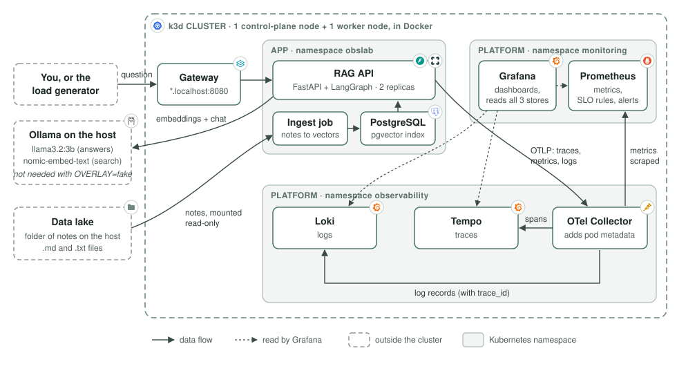

# Architecture

## Who owns what

The cluster is split the way a small company would split it:

| Namespace | Owner | Contents |
|---|---|---|
| `gateway` | platform | the shared `Gateway` listening on `*.localhost` |
| `monitoring` | platform | Prometheus Operator, Prometheus, Grafana, Alertmanager (kube-prometheus-stack) |
| `observability` | platform | OpenTelemetry Collector, Tempo, Loki |
| `obslab` | app team | the RAG API (2 replicas), the ingest job, PostgreSQL + pgvector, its `HTTPRoute` |

The app team ships its own route, its own alert rules (a `PrometheusRule`) and its own
dashboard (a labelled `ConfigMap`). The platform decides which namespaces may attach routes
to the Gateway (`obslab.dev/gateway-access=true`).

## One question, step by step

1. `POST /ask` arrives through the Gateway (Traefik) and reaches the API pod.
2. FastAPI auto-instrumentation opens the root span `POST /ask`.
3. The LangGraph flow runs. A callback handler turns each node into a span
   (`rag.node retrieve`, `rag.node generate`...), all under `invoke_workflow rag`.
4. Retrieval embeds the question (`embeddings nomic-embed-text` span) and asks PostgreSQL for
   the closest chunks by cosine distance (`SELECT rag.chunks` database span, HNSW index).
   If nothing scores above `OBSLAB_MIN_SCORE`, the question is rewritten once, then the
   flow falls back to "I don't know".
5. Generation streams the answer (`chat llama3.2:3b` span, with time to first chunk and
   token usage), then a cheap groundedness score is computed.
6. The API returns the answer, its sources and the trace ID.

Everything the pod emits goes over OTLP/HTTP to the Collector, which adds Kubernetes metadata
(pod, deployment, node) and sends traces to Tempo, logs to Loki, and exposes metrics that
Prometheus scrapes. The same trace ID is on the spans, on the log records and on histogram
exemplars, so Grafana can jump between the three.

## The index

The ingest job (a suspended CronJob, triggered by `task app:ingest`) reads the notes baked into
the image, embeds them with the configured model and rebuilds `rag.chunks` in a staging table.
The new table and its metadata (model, dimension, chunk count) replace the old ones in a single
transaction, so the API answers from the old index until the new one is complete. The API only
has a read-only role; `/readyz` reports 503 when the database is unreachable, empty, or holds an
index built with another model.

What protects the index:

- The API connects with a role that can only read. Only the ingest job can write.
- A re-index is swapped in atomically, so a reader never sees half of it.
- The index records which embedding model built it. Vectors from two models are not comparable,
  so a mismatch makes the API unready, with the reason in `/readyz`.
- Every query has a timeout, `k` is capped, and the SQL is parameterized.
- Connections are checked before use, so the API recovers by itself after a database restart.
- Only the API and the ingest job can reach the database (NetworkPolicy).
- Errors returned to clients carry an error type, never connection details.

`tests/e2e/test_pgvector.py` exercises each of these against a real PostgreSQL.

## The signals

| Signal | Examples | Where |
|---|---|---|
| GenAI metrics | `gen_ai.client.operation.duration`, `gen_ai.client.inference.usage.{input,output}_tokens`, time to first chunk | Prometheus |
| RAG metrics | retrieval top score, relevant documents, rewrites, fallbacks, groundedness | Prometheus |
| HTTP metrics | `http.server.request.duration` (stable semantic conventions) | Prometheus |
| Traces | one tree per question, GenAI attributes on each model call, a database span per vector query | Tempo |
| Logs | one record per answer with route, rewrites and groundedness, plus the trace ID | Loki |

Metric labels are bounded (operation, model, node, reason, error type). Prompts and answers
only appear on spans when `OBSLAB_CAPTURE_CONTENT=true`.

## Deployment options

| | Cluster, `local` overlay | Cluster, `fake` overlay | Docker Compose |
|---|---|---|---|
| Models | Ollama on the host | built-in fakes | Ollama or fakes, app on the host |
| Vector store | PostgreSQL + pgvector (StatefulSet) | same | PostgreSQL + pgvector (service) |
| RAM | ~4 GB + Ollama | ~4 GB | ~1.5 GB |
| Start | `task up` | `task up OVERLAY=fake` | `task stack:up` |

Compose and the cluster share the same SLO rules and dashboard (`deploy/shared/`), generated by
`scripts/gen_observability.py`.

## Design choices

**OpenTelemetry only, with the GenAI conventions.** One standard for the app, the platform and
the model calls, and any backend can read it. The GenAI conventions are still evolving, so every
metric and span name lives in one module (`src/obslab/telemetry/genai.py`).

**A Collector between the app and the backends.** The app only knows one OTLP endpoint. Routing,
batching, Kubernetes metadata and attribute filtering happen in the Collector, and changing a
backend does not touch the app.

**LangGraph instead of a single chain.** Each branch (retrieve, rewrite, generate, fallback,
grade) is a named node, so it gets its own span and its own latency series. "Why was this answer
bad" becomes a query.

**Hand-written instrumentation.** A callback handler maps LangChain and LangGraph events to spans
and metrics. It is about 200 lines, and every attribute in a trace can be traced back to a line
of code.

**Bounded metric labels, content off by default.** Labels are small enumerations (operation,
model, node, error type). Question text and identifiers never become labels, because every new
value is a new time series. In the cluster, the Collector also drops per-pod identifiers that
change on each rollout from metrics, while traces and logs keep them. Prompts and answers are
only recorded on spans when `OBSLAB_CAPTURE_CONTENT=true`.

**PostgreSQL + pgvector.** The index is shared, so the API is stateless: two replicas, rolling
updates without downtime, re-indexing without a restart. It is the only copy of the index: nothing is kept in a local file. The unit tests replace it
with an in-memory double.

**k3d for the cluster.** k3s in Docker gives a real control-plane and worker split for about
500 MB per node, with Traefik, storage and a load balancer included. `task stop` gives the
memory back in seconds.

**Pinned Helm charts for the platform, Kustomize for the app.** Charts are how these components
are usually consumed, and a pinned version makes an upgrade a one-line change. The app is small
enough for plain manifests with two overlays (`local`, `fake`).

**Gateway API instead of Ingress.** The platform owns the listener, each app owns its route.
Traefik implements it; the CRDs are the ones bundled with k3s.

**Ollama on the host.** The GPU stays where its drivers are. The cluster reaches Ollama through
an `ExternalName` Service and calls it by its full cluster name, which Ollama's host check
accepts.

**Restricted pods.** Every pod in the app namespace, PostgreSQL included, runs under the
restricted Pod Security Standard: non-root, read-only root filesystem, no capabilities. Memory
limits but no CPU limits, since throttling hurts latency more than it protects.

**Readiness without Ollama.** `/readyz` checks what the app owns: its graph and its index. It
does not call Ollama, because a shared dependency being down would empty the Service on every
replica at once; that case shows up as errors and alerts instead.

**A mode without models.** `OVERLAY=fake` swaps the models for deterministic fakes, so the whole
pipeline runs on a machine without a GPU, and in CI.
